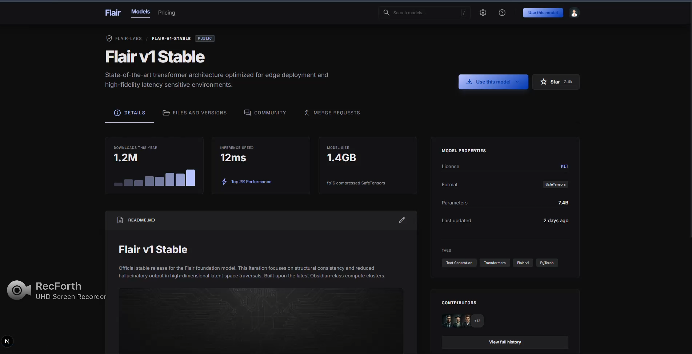
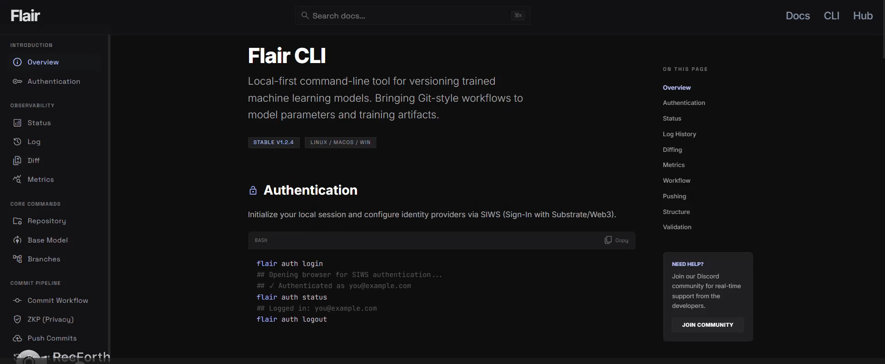

# Flair

Flair is a local-first repository system for collaborative machine learning development.

It enables researchers and organizations to track, preserve, and collaboratively evolve trained machine learning models through repositories, commits, branches, merges, and reproducible model history.

Think of it as Git styled version control for model evolution: contributors train in their own environments, publish updates as commits, and reconstruct, branch, merge, compare, and revert model states deterministically.




## Table Of Contents

- [What Flair Solves](#what-flair-solves)
- [Core Principles](#core-principles)
- [High-Level Architecture](#high-level-architecture)
- [Quick Start](#quick-start)
- [CLI Workflow At A Glance](#cli-workflow-at-a-glance)
- [Current Status](#current-status)
- [Contributing](#contributing)
- [Disclaimer](#disclaimer)

## What Flair Solves

As machine learning projects become increasingly collaborative, understanding how models evolve over time becomes increasingly difficult.

Researchers can often explain how code evolved throughout a project, but understanding how trained models evolved, which changes improved performance, and how contributions accumulated remains significantly harder.

Traditional ML collaboration often assumes centralized data and centralized training.

Flair is built for teams where:

- data must stay private and local
- multiple contributors train the same model asynchronously
- contribution provenance and auditability matter
- model evolution should be reproducible and reviewable
- trained model states should be reconstructable, branchable, and revertible

Instead of exchanging datasets, contributors exchange versioned model states and metadata while preserving deterministic history.

## Core Principles

- Local-first training: training runs in contributor-controlled environments.
- No raw data upload: only model artifacts, metadata, and optional proofs are exchanged.
- Model evolution workflows: repositories, commits, branches, merge, diff, reconstruction, and rollback for trained models.
- Verifiability: optional zkML proof flow for validating training claims.
- Merge compatibility requires a shared class space and matching output-layer dimensions across contributors.
- Provenance: commit lineage and contribution history are explicit and queryable.
- Deterministic reconstruction: any commit can reconstruct the exact corresponding model state.
- Cumulative progress: preserve and build upon previous model improvements rather than repeatedly recreating them.

## High-Level Architecture

```text
Local Contributor Environment
  -> Train on private data
  -> Generate model params / metadata / optional ZK proof
  -> Push commit via Flair CLI

Flair Repository Manager Backend
  -> Auth + repository metadata
  -> Commit ingestion + branch state
  -> Optional proof verification + provenance services

Optional Aggregation / Collaboration Layer (e.g., Flower-style workflows)
  -> Merge asynchronous updates
  -> Produce next global model state
```

The objective is not simply to store model files.

The objective is to preserve model evolution, contribution history, and reproducible progress across researchers, teams, and institutions.

## Quick Start

### 1. Prerequisites

- Python 3.10+

### 4. Install And Use Flair CLI

From the workspace root:
```bash
pip install -e ./flair_cli
flair --help
```

The CLI creates local config and session data under `~/.flair/`.

## CLI Workflow At A Glance

Typical end-to-end flow:

```bash
flair auth login
flair init --description "my federated model"
flair add
flair params create --model model.pt
flair metrics set --epoch 1 --accuracy 0.91
flair commit -m "Initial local training update"
flair push
flair log --graph
flair diff <commitA> <commitB>
```

Useful commands:

- `flair status`: current branch/head, commit completeness, unpushed count
- `flair branch`: list/create/delete branches
- `flair checkout <branch>`: switch branch
- `flair basemodel add|check|download|delete`: manage base model artifacts
- `flair revert` / `flair reset`: move local history state

Full command reference: see `flair_cli/README.md`.

## Data And Trust Model

- Raw datasets are not uploaded through Flair workflows.
- Shared artifacts include model parameters, commit metadata, metrics, provenance information, and optional verification artifacts.
- Session/auth tokens are stored locally (`~/.flair/session.json`), never private keys.
- Optional zkML support enables optional verification of model provenance without exposing raw data.

## Current Status

Flair is an early-stage, research-oriented project.

- APIs and data contracts may evolve quickly.
- Some modules are experimental.
- Backward compatibility is not guaranteed between early versions.

Flair currently prioritizes local reproducibility and commit integrity over hosted collaboration features.

Recommended use today: experimentation, protocol design, and developer research.

Flair currently focuses on model evolution infrastructure rather than model training, experiment orchestration, or model deployment.

## Contributing

Contributions are welcome.

Areas where help is especially valuable:

- CLI ergonomics and reliability
- proof and verification pipeline robustness
- docs and onboarding clarity

Contribution expectations:

- prioritize correctness and reproducibility
- include tests where practical
- keep changes focused and well documented


## Disclaimer

Flair is a tool for collaborative machine learning development, model evolution, and reproducible AI research.

It is not a model deployment platform, not a clinical or diagnostic system, and not a substitute for independent validation in real-world domains.

Flair version-controls model artifacts and training history but does not guarantee model correctness or training validity.